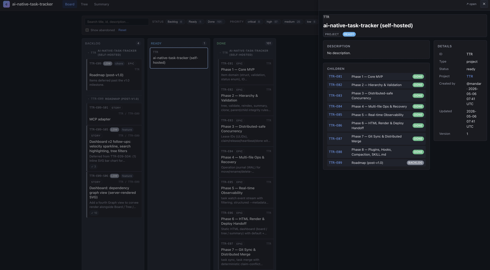
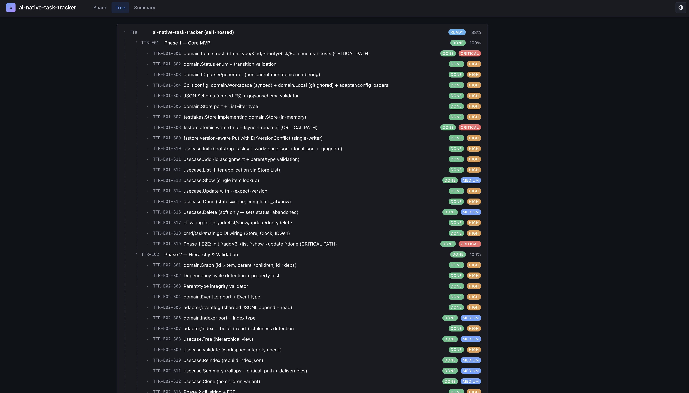
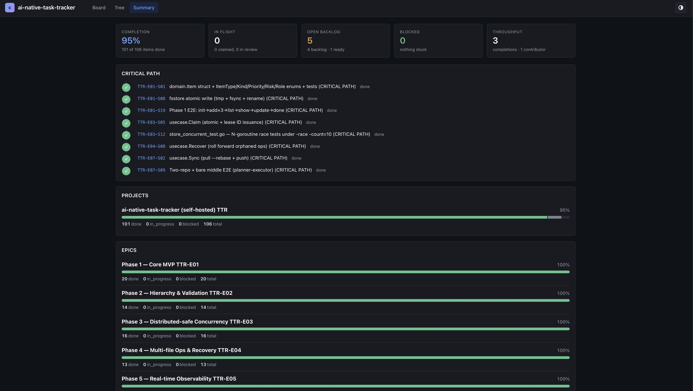

# corvee — local-first task tracker for humans and AI agents

[](https://github.com/mandarnilange/corvee/actions/workflows/ci.yml)
[](https://pkg.go.dev/github.com/mandarnilange/corvee)
[](LICENSE)

A **local-first, file-based, git-distributed task tracker** built for
coordinating work across humans and AI agents. The CLI is the
interface; state lives in your project's `.tasks/` directory; sync
across machines is plain `git push` / `git pull`.

> ### About the name
>
> A **corvée** (kor-VAY, French) is a feudal-era obligation requiring
> every member of a community to contribute labor to a shared task —
> building a road, harvesting a field — owed collectively, settled
> collectively. The metaphor maps directly to this tool's model: a
> backlog of work, a distributed crew of human and AI agents, each
> picking up a task, finishing it, and yielding the next claim. We
> drop the accent for ASCII; the binary is `corvee`.

This project **uses itself to track its own development**. The
`.tasks/` directory you see in this repo is the live, committed
workspace — every story you'll find in `.spec/tasks.json` is also a
file under `.tasks/items/`, and CI validates them on every push.

---

## Why another task tracker?

Most trackers fall into one of three buckets:

1. **SaaS** (Linear, Jira) — great UI, terrible for AI agents, vendor
   lock-in, network round-trips on every operation.
2. **In-repo Markdown** — versionable, but no atomic mutations, no
   structured queries, no real concurrency model.
3. **Local databases** — fast, but unsynced; can't coordinate across
   machines without a server.

This tool is the missing fourth option: **structured JSON files in
`.tasks/`, distributed via git, mutated through a deterministic CLI**.
It gives agents stable exit codes, a strict schema, optimistic
concurrency, and a deterministic merge rule for divergent
multi-machine claims (lower lease ID wins).

---

## Highlights

- **Local-first**: every operation reads/writes only `.tasks/` and
  exits. No daemon, no server, no network calls (except `git push`/
  `pull` when you ask for them).
- **Multi-agent ready**: atomic claim with lease IDs prevents two
  agents from working the same item; cross-machine claim conflicts
  resolve deterministically via spec §6 Layer 8.
- **Deterministic JSON output**: every command emits a JSON envelope.
  Agents branch on stable exit codes (2=usage, 3=not-found, 4=version
  conflict, 5=claim conflict, …) without parsing strings.
- **Plugin & shell-hook surface**: drop a binary in
  `.tasks/plugins/<name>/` or a script in `.tasks/hooks/<event>.sh`
  and it fires on every lifecycle event.
- **HTML dashboard**: `corvee render` produces a static-hostable site
  plus a deploy manifest for Vercel/Netlify/etc.
- **Single Go binary**: no runtime dependencies, cross-compiles for
  linux/{amd64,arm64} and darwin/arm64. ~14 MB.

---

## Dashboard

`corvee render` emits a static-hostable HTML dashboard with three
views. Auto / light / dark themes follow your system preference by
default and remember your override via a toggle in the topbar.

### Board

Kanban with epic grouping inside each status column. Filter bar
(status / priority / kind / assignee chips + free-text search +
show-abandoned toggle) — filter state lives in the URL hash so links
are shareable. Click any card to open the right-side drawer with
full item details (deps, blocks, journal, lease info, …). Cmd/Ctrl-
click still opens the standalone `items/<id>.html` page in a new tab.



### Tree

Hierarchical view with status + priority pills per node. Press `e`
or `c` to expand/collapse all. Click a title to open the same
drawer.



### Summary

Hero strip with completion %, in-flight, open backlog, blocked, and
throughput. Critical-path stepper with status-colored bullets.
Segmented per-project progress bars, per-epic rollups, and an
activity feed with timestamps, agent-colored avatars, and friendly
event labels.



---

## Quickstart

```sh
# 1. Install. Three options — pick one:
#
#    a) Go users (uses the latest tagged release):
go install github.com/mandarnilange/corvee/cmd/corvee@latest

#    b) Pre-built binary from a release tag (Linux/macOS):
#       (replace VERSION + PLATFORM)
curl -L "https://github.com/mandarnilange/corvee/releases/download/v1.0.0/corvee-linux-amd64" \
  -o /usr/local/bin/corvee && chmod +x /usr/local/bin/corvee

#    c) From source:
git clone https://github.com/mandarnilange/corvee
cd corvee
make build
sudo install bin/corvee /usr/local/bin/corvee

# 2. (Optional, for AI agents) Install the corvee skills into your
#    harness — auto-detects Claude Code, Cursor, Windsurf, …
npx skills add mandarnilange/corvee

# 3. Bootstrap a workspace in any project directory.
cd ~/my-project
corvee init --project MYP --agent-id alice

# 4. Plan some work.
corvee add project --project MYP --title "My project"
corvee add epic    --parent MYP    --title "Auth system"
corvee add story   --parent MYP-E01 --title "Login handler" --priority high

# 5. Pick the next item and work on it.
corvee next --auto-claim
# → returns {item, lease_id}; retain the lease_id

corvee heartbeat MYP-E01-S01 --lease-id <LEASE>          # every 30 min
corvee done      MYP-E01-S01 --lease-id <LEASE> --note "ships"

# 6. Sync with peers.
corvee sync                                   # git pull --rebase + push
```

See **[docs/getting-started.md](docs/getting-started.md)** for the
full first-time walkthrough.

---

## Skills (for AI agents)

Two skills ship with the repo so an AI coding agent can drive corvee
without being told the CLI surface up front. Install both with one
command:

```sh
npx skills add mandarnilange/corvee
```

[skills.sh](https://skills.sh/) auto-detects your harness (Claude
Code, Cursor, Windsurf, …) and drops the folders into the right
skill directory. Both skills are pure documentation — the agent
reads `SKILL.md` on each matching trigger phrase and shells out to
the `corvee` binary you installed above.

| Skill | When the agent reaches for it |
|---|---|
| [`corvee`](skills/corvee/) | Day-to-day agent loop: claim the next item, heartbeat while working, write journal notes, mark done, and `corvee sync` with peers. Triggered by phrases like *"what should I work on?"*, *"claim the next task"*, *"mark this done"*. |
| [`corvee-install`](skills/corvee-install/) | Onboarding: install the binary on a fresh machine, run `corvee init`, version-check against the latest release, in-place upgrade, and append a *"Using corvee in this repo"* block to `CLAUDE.md` / `AGENTS.md` so future agents pick the tool up automatically. Triggered by *"install corvee"*, *"set up corvee"*, *"upgrade corvee"*. |

For local development on the skills themselves (edits show up
immediately in the harness), symlink instead:

```sh
ln -s "$(pwd)/skills/corvee"         ~/.claude/skills/corvee
ln -s "$(pwd)/skills/corvee-install" ~/.claude/skills/corvee-install
```

---

## Documentation

| If you want to… | Read |
|---|---|
| Install and run your first command | [docs/getting-started.md](docs/getting-started.md) |
| Look up a specific verb | [docs/cli-reference.md](docs/cli-reference.md) |
| Understand the layering | [docs/architecture.md](docs/architecture.md) |
| Set up a multi-VM topology | [docs/recipes.md](docs/recipes.md) |
| Write a plugin | [docs/plugin-protocol.md](docs/plugin-protocol.md) |
| Read the full spec | [.spec/corvee-spec.md](.spec/corvee-spec.md) |
| Drop the day-to-day agent skill into your harness | [skills/corvee/](skills/corvee/) |
| Guide an AI agent to install / upgrade / bootstrap corvee in a fresh project | [skills/corvee-install/](skills/corvee-install/) |
| Understand a deviation from the spec | [docs/spec-questions.md](docs/spec-questions.md) |

---

## Dogfooding

This repository tracks its own development with the very tool it's
building. The `.tasks/` directory is committed; CI runs
`corvee validate` and `corvee summary` against it on every push.

```sh
make dogfood
```

The current state:

```text
99 items: 1 project + 8 epics (all done) + 90 stories (98 done, 1 ready)
```

(Phase 0 / TTR-E00 is intentionally absent — its IDs use `E00` which
the spec rejects per §4. The 10 stories in Phase 0 are documented in
`.spec/tasks.json` for historical context but not live-tracked. See
`docs/spec-questions.md` SQ-004.)

---

## Architecture (one-screen version)

```text
cmd/corvee/main.go                       # binary entrypoint (~30 lines wiring)
  ↓
internal/cli/                          # cobra wiring, flag parsing, JSON envelope
  ↓
internal/usecase/                      # application orchestration (one verb per file)
  ↓ (interfaces only)
internal/domain/                       # pure types + rules (no I/O, no time)
  ↑ (implements ports)
internal/adapter/                      # filesystem, git, ULIDs, fsnotify, render
```

The dependency rule is enforced by `golangci-lint depguard`. Domain
imports nothing from this codebase; adapter implements ports;
usecase coordinates. Anything that touches the filesystem or the
clock lives in adapter.

For depth, see [docs/architecture.md](docs/architecture.md).

---

## Development

```sh
make help                    # list every Makefile target
make ci                      # everything CI runs (lint, race tests, e2e, coverage)
make test-unit               # fast inner loop (sub-2s)
make build-all               # cross-compile linux/{amd64,arm64} + darwin/arm64
make skill-tarball           # produce dist/corvee-skill.tar.gz
```

CI splits each gate into a separate job (see
`.github/workflows/ci.yml`) so you can read the run page top-down and
see exactly which check failed. A tag push (e.g. `v1.0.0`) triggers
`.github/workflows/release.yml`, which builds artifacts and creates
a GitHub Release.

---

## Status

All 9 implementation phases are shipped (100 / 100 stories done):

| Phase | What it added |
|---|---|
| 0 | Repo skeleton, Makefile, CI |
| 1 | Single-user backlog (init/add/list/show/update/done/delete) |
| 2 | Hierarchy + validation + sharded events log + index cache |
| 3 | Distributed-safe concurrency (claims, lease IDs, capability match) |
| 4 | Multi-file ops + crash recovery |
| 5 | Real-time observability (`corvee watch`, journal metadata) |
| 6 | HTML render + deploy handoff manifest |
| 7 | Git sync + distributed merge — multi-VM ready |
| 8 | Plugins, hooks, compaction, SKILL.md |

The next milestone is the `v1.0.0` tag (cuts a GitHub Release with
binaries + skill tarball).

---

## Contributing

This project follows strict TDD per `CLAUDE.md` § 3: every functional
change is delivered as failing test → minimum implementation → green
test → commit. CI rejects PRs that decrease coverage in
`internal/domain/` (≥90%) or `internal/usecase/` (≥90%).
Read [`CONTRIBUTING.md`](CONTRIBUTING.md) before opening a PR. It
covers the TDD rule, `make ci`, branch naming, conventional commits,
and sign-off requirements.

Open a PR against `main`. The pre-push git hook runs `make ci`
locally; install it once with `make hooks-install`.

---

## License

MIT. See [LICENSE](LICENSE).
